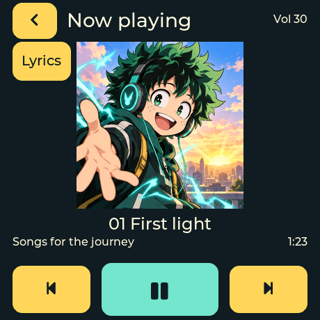
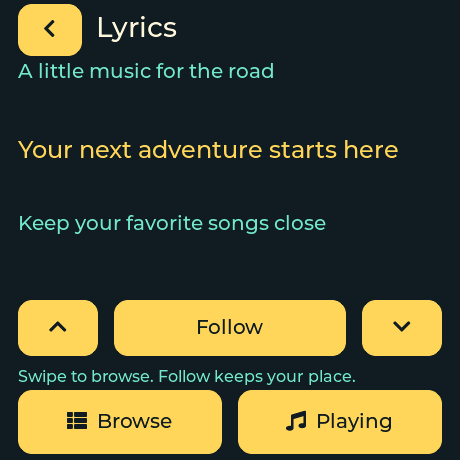
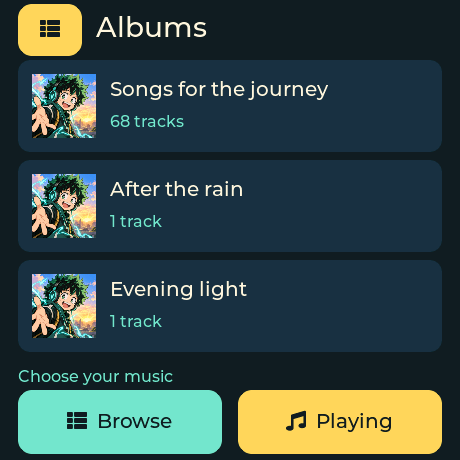
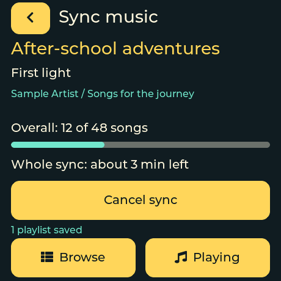

# PearlPod

**PearlPod is a customizable pocket music player.** Install it on a CS43131 FakePod Nano, put your music on microSD, and listen through the 3.5 mm headphone jack. Browse albums and playlists on the touchscreen, read along in lyric mode, and give the player your name, colors, pictures and greetings.

It is part of [HiPhi.audio](https://hiphi.audio/pearlpod.html). Music plays directly from the card; WiFi is optional for copying Plex playlists from your home library.

[See the player and its features](https://hiphi.audio/pearlpod.html) · [Install over USB](https://hiphi.audio/flash/pearlpod/) · [Download firmware](https://github.com/open-horizon-labs/pearlpod-releases/releases) · [Buy the hardware](https://www.tindie.com/products/johnson/fakepod-nano-cnc-aluminum-amoled-audio-player/)

**Alpha, tested on one physical CS43131 unit.** The PCM5102 variant is unverified. Confirm the DAC with the seller before ordering. Firmware is free for noncommercial use.

## See what it does

These are production firmware UI renders using Pearl’s personal anime-inspired packs. The library, lyrics, sync counts and ETA are illustrative; these are screens, not device photographs. Album covers take priority when present; the pictured playback screen uses the theme’s illustration because the sample song has no cover.

| Personal welcome | Now Playing | Lyric mode |
| --- | --- | --- |
|  |  |  |

| Album browser | Playlist sync | Personal farewell |
| --- | --- | --- |
|  |  |  |

## Player features

- **Music on microSD:** MP3, FLAC and WAV in ordinary folders. Browse by album, artist, folder or playlist; album and artist tags organize the library, and disc/track tags set album order.
- **Album artwork:** embedded MP3/FLAC covers or neighboring cover files appear in Browse and Now Playing. A theme illustration fills in during playback when art is missing.
- **Touch and buttons:** swipe to browse, tap to play, use large playback controls, and adjust volume with the two physical buttons. Volume and the selected track survive restart.
- **Playlists:** M3U, M3U8 and XSPF with local paths, preserving the chosen order and repeated songs.
- **Lyrics:** timed LRC highlights and follows the current line; scroll ahead and tap Follow to return. Untimed lyrics can be read manually. Timed appearance still needs a physical-device visual check.
- **Personal theme packs:** your name, colors, welcome/farewell pictures and greetings live on the card. Rotate favorite packs and scene variants between starts without changing playback controls or reflashing.
- **Optional Plex sync:** export `PP:` playlists from a selected Plex profile through a home runner. Convert existing music with FFmpeg, embed covers, carry over lyrics, reuse shared songs and unchanged files, and resume after an interruption. The player shows the current playlist/song, progress and ETA.
- **Fast ordinary starts:** load the saved library index instead of rescanning. Rescan only after manual changes or a changed sync.
- **Power controls:** darken the screen while listening, sleep and wake with a hold, and turn WiFi off when its session ends. Active USB serial sessions block automatic screen sleep and deep sleep.
- **Home WiFi and diagnostics:** captive setup portal, optional microSD credential import, up to four saved networks, and a read-only status endpoint while connected for diagnostics.

## Start listening

1. Install with desktop Chrome or Edge and a USB data cable using the flash page above.
2. Put MP3, FLAC or WAV files under `music/` on microSD. Ordinary folders such as `music/Artist/Album/01 - Title.mp3` work.
3. Insert the card, open Browse, choose an album and tap a song. After changing files manually, choose **Rescan card** from the library menu.

Boot loads a saved library index. A missing or invalid index triggers a scan; a changed sync rebuilds it. See [index behavior](docs/LIBRARY-INDEX.md).

## Controls

Browse by Albums, Artists, Folders or Playlists. Swipe vertically to scroll, left for the next page, or right from tracks and Now Playing to return to albums. Page buttons are also available. Previous and next follow the selected collection’s order.

| Button | Short press | Hold about two seconds |
| --- | --- | --- |
| Power / BOOT (GPIO0) | Volume down | Stop playback and sleep; release, then hold again to wake |
| Screen lock (GPIO48) | Volume up | Turn the display off or on while music continues |

Volume and the selected track survive restart. Playback resumes paused at the beginning of that track.

The screen sleeps after 45 seconds without interaction; tap to wake without selecting a song. Paused playback sleeps after five idle minutes. An active USB serial host blocks both automatic sleep paths; WiFi and library work also block player sleep. Deep sleep does not disconnect the battery, and standby draw has not been measured.

## Artwork, playlists and lyrics

Use embedded MP3/FLAC artwork or a neighboring `cover.jpg`, `cover.png`, `folder.jpg` or `folder.png`. Supported images are at most 400 KiB and 1,024 pixels per dimension. When artwork is missing, the selected theme’s illustration is used when available; otherwise the player uses the neutral fallback.

Put M3U, M3U8 or XSPF playlists inside `music/`. Relative paths resolve beside the playlist; order and intentional duplicates are preserved. Network URLs and paths outside the music root are skipped. For lyrics, put a timed `.lrc` or untimed `.txt` file beside its song with the same filename stem. Open **Lyrics** from Now Playing when lyrics are present. Timed lyric appearance still needs a physical visual check.

Album and artist tags organize the library; disc and track tags set album order, followed by natural filename sorting. UTF-8 paths are supported up to 511 bytes, but the UI font does not cover every CJK character. Library capacity depends on available memory. A failed rescan retains the previous index and reports skipped entries.

Audio is decoded to **16-bit stereo at 48 kHz**, including FLAC and WAV; higher-resolution sources are resampled. Optional [card preparation](tools/prepare_card.py) makes smaller covers and title sidecars without changing audio files.

## WiFi and Plex sync

WiFi stays off at startup. Open Browse → the library menu → WiFi → **Set up WiFi**, then join the open setup network shown on the player. The captive page should open automatically; otherwise visit `http://192.168.4.1`. Select your home network, enter its password and save. PearlPod remembers up to four 2.4 GHz networks.

You can also import credentials from a root-level `wifi.toml` using [the example](examples/wifi.toml.example). A successful import replaces the saved network list and removes the file; a failed import preserves both. See [file format and limits](docs/CARD-WIFI.md).

**Sync now** asks a separately configured home runner to export the selected Plex profile’s `PP:` playlists. The prefix is stripped on the card. The runner converts existing library files with FFmpeg, embeds artwork, carries over supplied lyrics and transfers files through lftp. Songs shared by playlists are stored once. The player shows the playlist, current song, progress and estimated time remaining. Completed playlists are checkpointed individually and reused after an interruption. See [runner setup](syncer/README.md).

Setup, diagnostics and sync have no PearlPod login. Use them on your trusted home network. **Connect for diagnostics** exposes a read-only `/status` endpoint at the player’s LAN address. Setup expires after five inactive minutes and diagnostics after fifteen minutes; the radio turns off when the session ends. See [WiFi verification](docs/WIFI-EXECUTION.md) and [sync evidence](docs/SYNC-IMPLEMENTATION.md).

## Make it yours

Pearl’s personal packs use My Hero Academia and Assassination Classroom inspired illustrations, with several welcome and farewell scenes. Her name is inserted into the greeting separately from the artwork. The screenshots above show that example; the firmware can load different names and packs from any music card.

Start with [Midnight, Sakura or Sunburst](https://github.com/open-horizon-labs/pearlpod-releases/tree/main/theme-packs) for colors and greetings, or create a pack with your own pictures and phrases. Copy the pack’s `Themes/` directory and `Person.toml` into `music/`. For example:

```toml
name = "Your name"
themes = ["midnight", "sakura"]
rotate = true
```

Restart to apply changes. With rotation enabled, each boot chooses the next favorite pack; welcome and farewell scene variants advance when that pack returns. The palette stays fixed during the session. A picture and its phrase are selected together, and album artwork takes priority during playback.

See [theme-pack installation and format](docs/THEME-PACKS.md) to supply colors, 240×240 pictures and personalized phrases. This repository’s `theme-packs/Default` is a synthetic test fixture. The public starter packs contain palettes and greetings with neutral fallback art; Pearl’s personal pack is separate from those downloads.

## Update and recover

From a clone of this repository, run:

```sh
tools/update.sh /dev/cu.usbmodemDEVICE
```

The updater downloads released firmware when needed, verifies checksums and preserves preferences. It installs a pinned esptool in a local virtual environment if necessary. `tools/update.sh --check` checks the package without flashing. Wireless firmware updates are not implemented.

For a boot loop, use `tools/recover.sh`. It retries up to twenty times to catch the USB connection and restores the last device-verified application while preserving preferences. It refuses ambiguous USB targets unless you specify a port. See [recovery instructions](docs/RECOVERY.md). Keep a local factory-flash backup before replacing the original firmware.

## Build locally

Install ESP-IDF **v5.5.5** and source its `export.sh`. Host checks also need a C compiler, Node.js and a `.venv` Python environment with Pillow; codec checks need FFmpeg.

```sh
python3 -m venv .venv
.venv/bin/pip install Pillow
tools/check.sh
tools/check_codecs.sh
tools/build.sh
tools/flash.sh /dev/cu.usbmodemDEVICE
```

Binaries belong in [GitHub releases](https://github.com/open-horizon-labs/pearlpod-releases/releases). `tools/fetch-firmware.sh` downloads them with GitHub CLI. The merged image flashes at offset zero; packaged checksums identify each artifact. Button GPIOs and the volume cap are configurable through menuconfig.

See [hardware evidence](docs/HARDWARE.md), [verification](docs/VERIFICATION.md) and [design](DESIGN.md). `tools/render_ui.sh /tmp/pearl-ui-check` renders the production LVGL interface with fixture music after IDF has fetched managed components. To capture your own card pack, set `PEARL_PREVIEW_PACK=/path/to/pack` and `PEARL_PUBLIC_FIXTURES=1` when running it; the pack directory must contain `Person.toml` and `Themes/`. The optional captures include welcome, farewell, browsing, playback, lyrics and sync for four scene selections.

## License

Firmware source is available under [PolyForm Noncommercial 1.0.0](LICENSE), free for noncommercial use. [Contact Open Horizon Labs](https://hiphi.audio/bespoke.html) about commercial use. Dependencies retain their own terms; see [third-party licenses](THIRD_PARTY.md).
